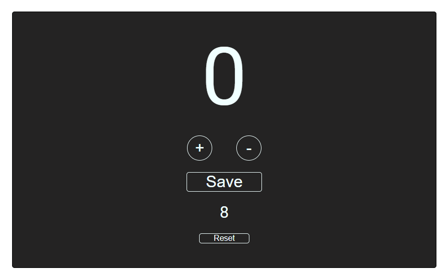

# Simple Counter App

This is a simple counter app that allows users to add, remove, and save counts. It is built using HTML, CSS, and JavaScript. The HTML content is dynamically created using JavaScript.

This is the [link](https://nimble-malabi-36ca9c.netlify.app/).

## Table of Contents

- [Installation](#installation)
- [Usage](#usage)
- [Support](#support)
- [Credits](#credits)
- [License](#license)

## Installation

To install this app, simply clone this repository and open the `index.html` file in your preferred browser.

## Usage

To use the app, follow these steps:

1. Click the "Add" button to increase the counter.
2. Click the "Remove" button to decrease the counter.
3. Click the "Save" button to save the current count.
4. Double click the "Reset" button to reset the saved count.

## Support

If you have any questions or need help with this app, please open an issue in this repository.

## Credits

This app was created by Pekko - GB.

## License

This project is licensed under the [MIT License](LICENSE).
